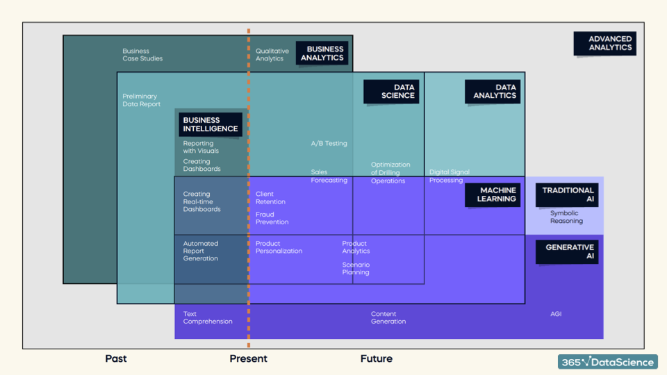

# The Various Data Science Disciplines

## 📌 Common Data Science Buzzwords

You will frequently hear:

- Data  
- Data Team  
- Big Data Team  
- Business Intelligence (BI)  
- Data Science (DS)  
- Business Analytics (BA)  
- Data Analytics (DA)  

### ❓ Why so much confusion?

Because the **data industry is constantly evolving**.  
New tools, roles, and responsibilities keep changing how these terms are used.

---

## 🧠 Analysis vs Analytics

### 🔍 Analysis
Focuses on the **past**:

- What happened?
- Why did it happen?
- How did it happen?

Used mainly for understanding and explaining historical data.

---

### 📈 Analytics
Focuses on the **future**:

- Predicting outcomes  
- Improving decisions  

Two types:

**Qualitative Analytics**  
→ Intuition + experience + logical thinking  

**Quantitative Analytics**  
→ Mathematical formulas + algorithms + data models  

---

## ⏳ Past, Present & Future View of Data Fields

To understand these terms clearly, divide them by time:

### 📚 Past-focused
- Business Intelligence  
- Reporting  
- Dashboards  
- Descriptive analysis  

### ⚙ Present-focused
- Business Analytics  
- Data Analytics  
- Optimization  
- Forecasting  

### 🚀 Future-focused
- Data Science  
- Machine Learning  
- Artificial Intelligence  
- Generative AI  

---

## 🗂 Major Disciplines in the Data Field

- Business Intelligence  
- Business Analytics  
- Data Analytics  
- Data Science  
- Machine Learning  
- Artificial Intelligence  
- Traditional AI vs Generative AI  
- Advanced Analytics  

Each builds on the previous level and moves toward more prediction and automation.

---

## 📊 Data Science Disciplines Timeline

## ✅ Key Insight

As we move from **past → present → future**, we go from:

📊 Reporting → 📈 Analytics → 🤖 Intelligent systems

Understanding this timeline removes most confusion around data science buzzwords.